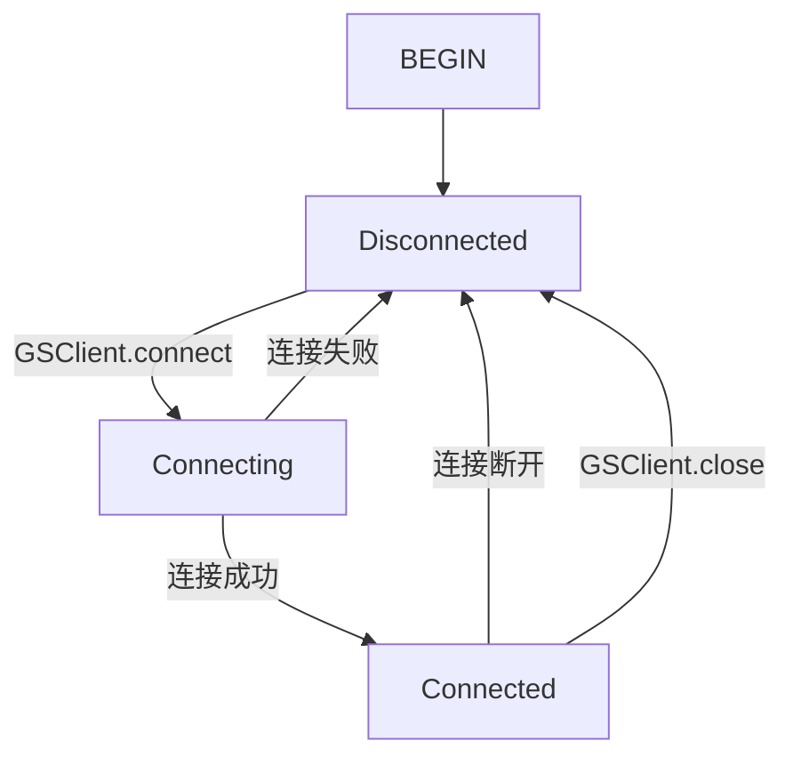

---
## 核心需求

| 软件 | 编辑体验 |  搜索 | 跨平台 | 多设备同步 | 本地存储 | 任务管理 |
|---|---|---|---|---|---|---|
| mweb | ⭐  |  ⭐⭐ |⭐| ✔️ | ✔️ |❌|
| workflowy  | ⭐⭐⭐ |  ⭐⭐⭐ | ⭐⭐⭐ |✔️| ❌ |✔️|
| sublime |  ⭐⭐ |  ⭐ |⭐⭐| ✔️ | ✔️ |❌|
| obsidian |  ⭐⭐⭐ |  ⭐⭐⭐ |⭐⭐| ✔️ | ✔️ |✔️|

- 两年前：[mweb](https://zh.mweb.im/)
    - 主要在macOS下工作。
    - 文档是markdown文本。
    - mweb可以利用iCloud在macOS和iOS同步。
- 最近两年：[workflowy](https://workflowy.com/) + [sublime](https://www.sublimetext.com/) + [todoist](https://todoist.com/) + [recoll](https://www.lesbonscomptes.com/recoll/)
    - 开始用windows，一开始没有找到合适的mweb替代品。
    - 使用workflowy进行会议记录，思路整理。用sublime编写正式的文档。用todoist做任务管理。
    - 文档类型开始变多，不只是文本文档，还有word、excel、powerpoint、xmind、pdf……，使用recoll进行全文搜索。
- 近期：[obsidian](https://obsidian.md/) + recoll
    - [OKR + GTD + Note => Logseq](https://www.bmpi.dev/self/okr-gtd-note-logseq/)
    - obsidian基本可以替代 workflowy + sublime + todoist
        - iOS同步只能用iCloud或者obsidian自己的同步服务。
        - 任务管理没有手机推送提醒。

---
## 上手

- [官方帮助文档库 - 快速开始 - 本地](obsidian://open?vault=Obsidian%20Help&file=%E7%94%B1%E6%AD%A4%E5%BC%80%E5%A7%8B) 
- [官方帮助文档库 - 快速开始 - web](https://publish.obsidian.md/help-zh/%E7%94%B1%E6%AD%A4%E5%BC%80%E5%A7%8B) 
- [[obsidian安装配置]]
 
---
## 编辑体验

- 速度 >> 功能性
    - 启动和打开文档
    - 文字输入
    - 文档间跳转
        - Navigate forward / backward
        - Quick switcher
        - Hotkeys for specific files

### markdown

- 被广泛支持的文本格式，具备良好的可迁移性。
- Live preview，所见即所得。

### Outliner插件

![[demo.gif|800]]
![[demo2.gif|800]]

### 文档嵌套

[[2022-02-21 项目A压测进展沟通]]
[[2022-02-14 项目A压测进展沟通]]

### mermaid 演示

![[SDK桥接服务]]




### 多行编辑


按住 `alt`（mac 上是 `option`）并点击，可以创建多个光标，对多行同时进行编辑。

-  第一行
-  第二行
- 第三行

---
## 搜索

### 为什么叫知识库？

 - 双链结构，体现文档之间的联系。
     - Backlinks
     - Outgoing links
     - Graph View
 - 文档可以通过front matter来定义属性，可以基于属性来搜索和展示。

### 常见的搜索模式

[Obsidian Help - 插件 - 搜索](obsidian://open?vault=Obsidian%20Help&file=%E6%8F%92%E4%BB%B6%2F%E6%90%9C%E7%B4%A2)

- 基于文档名称的搜索
- 全文检索
- 常用的搜索条件可以保存下来。
    - 可以保存到“星标”里
    - 可以[[文档里嵌入搜索|嵌入在文档]]里

### 根据文档的分类进行查找

- 如何分类？
    - 文件夹
- 我常见的搜索模式，比如找文档[[2022-02-14 项目A压测进展沟通]]
    - 先想一下文档的分类：压力测试
    - 找到文件夹：工作/业务管理/技术中心/压力测试
    - 按最近修改时间排序
    - 找到我想要的文件
- 问题
    - 一个文件只能属于一个文件夹
        - 对于[[2022-02-14 项目A压测进展沟通]]，以下两个目录都是合理的划分方式
            - 工作/业务管理/技术中心/压力测试
            - 工作/业务管理/游戏项目/tkw


### 用tag分类

- obsidian的tag机制
    - 写在front matter里
    - 直接写在文档的任何位置
- tag有层级概念
    - `#工作`
    - `#工作/业务管理/技术中心/压力测试`

### 用dataview插件制作索引页面

[[Index]]

- 安装dataview插件并启用Javascript Queries。
- 使用Force note view mode，打开[[Index]]索引页面时始终保持为preview状态。

### dataview还能做什么？


#### 最近修改的文件

```dataview
TABLE file.mtime as Edited
FROM ""
WHERE date(now) - file.mtime <= dur(3 days) and file.name != "Index.md"
SORT file.mtime desc
```

#### 最近创建的文件

```dataview
TABLE file.ctime as Created
FROM ""
WHERE date(now) - file.ctime <= dur(3 days)
SORT file.ctime desc
```

#### 搜索TAG
```dataview
list from #工作/攸乐
```

#### 搜索任务
```dataview
task from #工作/业务管理/游戏项目 

```

#### 社区showcase

[Dataview plugin snippet showcase - Share & showcase - Obsidian Forum](https://forum.obsidian.md/t/dataview-plugin-snippet-showcase/13673)

---
## 任务管理

### Kanban插件

![[kanban1.png|800]]
![[kanban2.png|800]]
[[Board]]

### Tasks插件

[Introduction - Obsidian Tasks](https://schemar.github.io/obsidian-tasks/)

- 写文档的同时，把任务创建出来。无需事后整理，也能很方便的找到。
- 可以为任务设置优先级、截至日期、计划日期、开始日期、实际完成日期
- 可以创建循环出现的任务
- 可以跟kanban很好的结合。

[[Tasks]]

---
## 多设备同步

- 文档库（Vault）是本地存储的，可以使用各种同步软件进行同步。
    - Synology Drive
    - One Drive
- 对比云笔记软件的优势：软件不在了，数据还在。
    - 想想虾米音乐。

---
## 其他类型的文档的管理

- 问题
    - 文档类型很多：word、excel、powerpoint、xmind、pdf……，用obsidian这样的文本知识库管理不了
    - 文档太多不好找。
- 解决方案
    - 按目录结构进行分类
    - 使用recoll进行全文检索
        - everything应该只能按文件名搜索吧？
        - recoll搜索结构带内容预览，类似于Google

![[Pasted image 20220224105204.png]]

- [recoll windows版下载地址](https://nextcloud.youle.game/s/EfddEJm8anjyjnz)
    - 需要配置索引目录
    - 需要添加一个计划任务，开机时自动更新索引

## 快捷键跨平台同步

macOS和Windows的快捷键，一般有一个映射关系：

    ctrl <---> command
     alt <---> option

比如Obsidian的快捷键配置里，如果在Windows下把快捷键定义为

    ctrl + shift + p

那么在macOS下，快捷键就是

    command + shift + p

但问题是，ctrl 和 command 在键盘上的物理位置不一样。

我的需求是让同一个快捷键在macOS和Windows的物理按键位置保持一致，不需要调整我的肌肉记忆 。
我的习惯是使用Autohotkey，让Windows下的快捷键键位跟macOS保持一致。

Autohotkey部分配置，[AHK配置完整版](https://gist.github.com/oylbin/d6fcbcd273477c6000981a0a0a60c583)

```
; 以下操作让按键位置与macOS保持一致: copy, paste, cut, undo, select all, save, search
; 如果需要视情况进行不同的操作，可以在“特定软件相关的快捷键”部分单独设置。

!c::Send, ^c
!v::Send, ^v
!x::Send, ^x
!z::Send, ^z
!a::Send, ^a
!s::Send, ^s
!f::Send, ^f


#if WinActive("ahk_exe WindowsTerminal.exe") 

!c::Send ^{insert}
!v::Send +{insert}

#if

#if WinActive("ahk_exe Obsidian.exe")

; navigate forward
!]::Send, ^]

; navigate backward
![::Send, ^[

; command palette
!+p::Send, ^+p

#if

```


---
## 为什么要写文档？

- 好记性不如烂笔头
- 知识积累和传承
- 工作中要写好的文档
    - 会议记录
        - 会议上达成的共识
        - 会后的代办事项
    - 方案设计文档
        - 需求分析
        - 各种方案的优劣对比
    - GIT仓库的README
        - 面向用户，如何使用这个库/框架/工具
        - 面向开发者，如何搭建开发环境
    - BUG/性能问题事故总结
        - 问题现象
        - 分析和定位问题的过程
        - 解决方案
        - 后续改进措施


---
## 丰富的插件满足每个人个性化的需求

![[Pasted image 20220224112648.png|800]]

---
## 参考资料

- [mweb](https://zh.mweb.im/)
- [workflowy](https://workflowy.com/)
- [sublime](https://www.sublimetext.com/)
- [todoist](https://todoist.com/)
- [recoll](https://www.lesbonscomptes.com/recoll/)
- [mermaid](https://mermaid-js.github.io/mermaid/#/)
- [obsidian](https://obsidian.md/)
    - [[obsidian安装配置]]
    - [官方帮助文档库 - 快速开始](https://publish.obsidian.md/help-zh/%E7%94%B1%E6%AD%A4%E5%BC%80%E5%A7%8B) 
- obsidian第三方插件
    - Outliner
    - Dataview
        - [Dataview](https://blacksmithgu.github.io/obsidian-dataview/)
        - [Dataview plugin snippet showcase - Share & showcase - Obsidian Forum](https://forum.obsidian.md/t/dataview-plugin-snippet-showcase/13673)
    - Kanban
    - Tasks
        - [Introduction - Obsidian Tasks](https://schemar.github.io/obsidian-tasks/)
    - Remember cursor position
    - Force note view mode
    - Hotkeys for specific files
- [recoll windows版下载地址](https://nextcloud.youle.game/s/EfddEJm8anjyjnz)
- [AHK配置完整版](https://gist.github.com/oylbin/d6fcbcd273477c6000981a0a0a60c583)
- [OKR + GTD + Note => Logseq](https://www.bmpi.dev/self/okr-gtd-note-logseq/)
- [我的人生管理系统](https://www.bmpi.dev/self/life-in-plain-text/)