日志的使用


```python
import logging
from logging.handlers import RotatingFileHandler


# 设置日志的记录等级  
logging.basicConfig(level=logging.DEBUG)  # 调试debug级  
# 创建日志记录器，指明日志保存的路径、每个日志文件的大小，保存的日志文件个数  
file_log_hanlder = RotatingFileHandler("logs/", maxBytes=1024 * 1024 * 100, backupCount=10)  
# 创建设置日志记录格式  
formatter = logging.Formatter('%(levelname)s %(filename)s:%(lineno)d %(message)s')  
# 为刚创建的日志记录器设置日志记录格式  
file_log_hanlder.setFormatter(formatter)  
# 为全局的日志工具对象(flask app中使用的) 添加日志记录器  
logging.getLogger().addHandler(file_log_hanlder)
```

## 项目数据库设计

语法解释：`<|--` 表示继承，`+` 表示 `public`，`-` 表示 `private`

```mermaid
classDiagram
      User --> House
      House-->Area
      class User{
          int id
          string name
          String password
          String mobile_phone
          String avator_url
          String real_name
          String real_id_card
      }
      class House{
          -PK  id
          -FK  user_id
          -String title
          -int area_id
          -float price
          -string index_image_url # 冗余字段
          -int order_count
          
      }
      class Area{
          -int area_id
          -string name
      }
      class House_image{
          -int image_id
          -string url
          -int house_id
      }
      class Facility{
          -int facility_id
          -string name
      }
      class House_Facility{
          -int id
          -int house_id
          -int facility_id
      }
      class Order{
          -int id
          -int user_id
          -int house_id
          -time create_time
          -time start_date
          -time end_date
          -bool status # 订单状态
          -float price
          -float ammount # 冗余字段，节省开销
          -string days # 
          -string comment
      }
```



多对多的表在定义时，通过普通方法定义，使用relationship方法关联查询
```python
facilities = db.relationship("Facility", secondary=house_facility)  # 房屋的设施
```